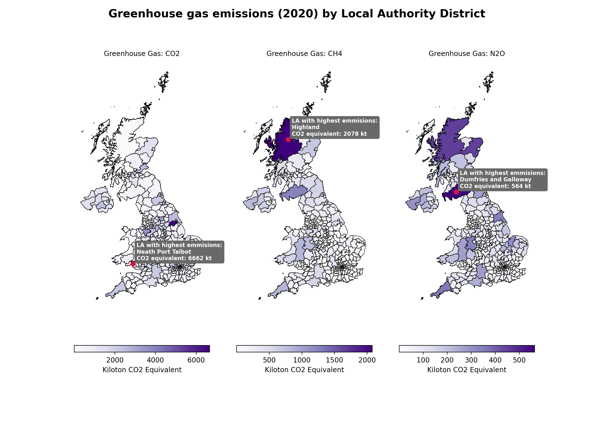

## Running this notebook 

All code can be found [here.](Greenhouse%20Gasses.ipynb) 

This notebook makes use of geopandas. To install I'd recommend creating a new environment to avoid dependancy conflicts. You can do so by running the following code: 

```
conda create -n geo_env
conda activate geo_env
conda config --env --add channels conda-forge
conda config --env --set channel_priority strict
conda install python=3 geopandas
```

### Accessing the new environment in jupyter 

For your new environment to be accessible in your current jupyterlab / jupyter notebook setup, you want to install nb_conda_kernels in your base environment: 

```(base)$ conda install -c conda-forge nb_conda_kernels```

Then activate your new environment (here geo_env) and install ipykernel: 

```
(base)$ conda activate geo_env
(geo_env)$ conda install ipykernel
(geo_env)$ conda deactivate
```

You'll now be able to launch juptyter lab or notebook from your base environment, and choose the correct kernel (conda environment) from a drop down in the top right hand corner. 

## Data 

Downloaded Local Authority shapefiles from from the UK gov geoportal website: https://geoportal.statistics.gov.uk/datasets/ons::local-authority-districts-may-2022-uk-bfe-v3-1/about 

Downloaded greenhouse gas emmissions data from: update 
Possible additional source of data: https://ckan.publishing.service.gov.uk/dataset/uk_greenhouse_gas_emissions 

To run this notebook, you'll need to download and save the files in a data/ directory. 



